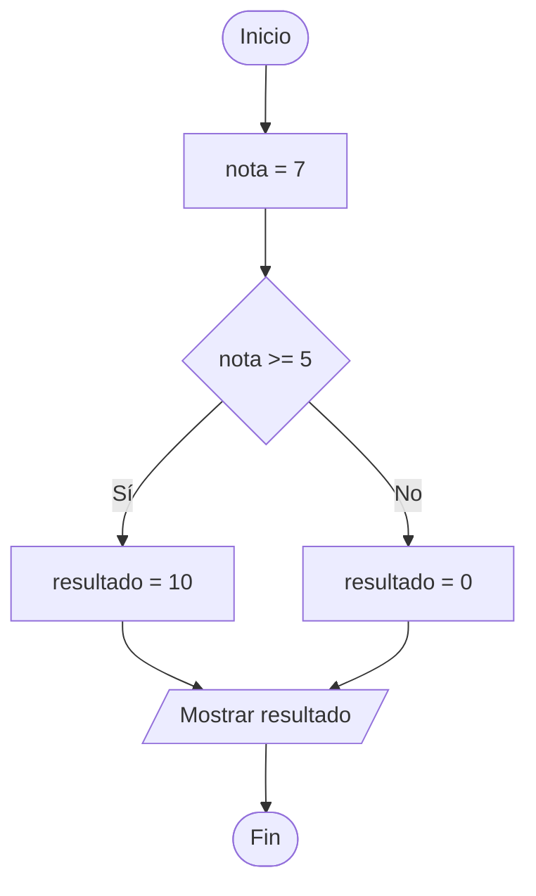

# Retos de leer código solo con números

### Reto 0: Del diagrama de flujo al código

Observa el siguiente diagrama de flujo y escribe el programa Python equivalente. Después, indica qué valor se muestra por pantalla.



**Restricción:** Utiliza una estructura `if` / `else`.

---

### Reto 1: Conversor de Temperatura

* Crea un programa que declare una variable `celsius` con el valor `25`. Calcula la temperatura equivalente en grados Fahrenheit utilizando la fórmula

```
F = C x 1.8 + 32
```

donde `C` representa la variable `celsius` y `F` la variable `farenheit`, que es donde guardas el resultado final.

Finalmente, muestra el valor de `fahrenheit`.

**Además:** Dibuja el diagrama de flujo correspondiente al programa.

---

### Reto 2: Control de Aforo

* **Enunciado:** Una sala de juegos tiene un límite de capacidad de 30 personas. Crea un programa que tenga una variable `personas` con el valor `34`.
  * Si la variable `personas` es mayor que 30, define una variable `exceso` que contenga cuántas personas están por encima del límite y muestra `exceso`.
  * En caso contrario (si es menor o igual a 30), asigna el valor `0` a `exceso` y muéstralo.
* **Restricción:** Usa una estructura `if` / `else`.
* **Además:** Dibuja el diagrama de flujo correspondiente al programa.

---

### Reto 3: Calificador de Rangos Numéricos

* **Enunciado:** Crea un programa con una variable `num` inicializada en `45`.
  * Si `num` es menor que `0`, guarda en la variable `categoria` el valor `-1`.
  * Si `num` está entre `0` y `50` (incluidos), guarda en `categoria` el valor `0`.
  * Si `num` es mayor que `50`, guarda en `categoria` el valor `1`.
  * Al final, muestra la variable `categoria`.
* **Restricción:** Utiliza estructuras `if` / `else` anidadas y solo expresiones numéricas/comparaciones básicas.
* **Además:** Dibuja el diagrama de flujo correspondiente al programa.
