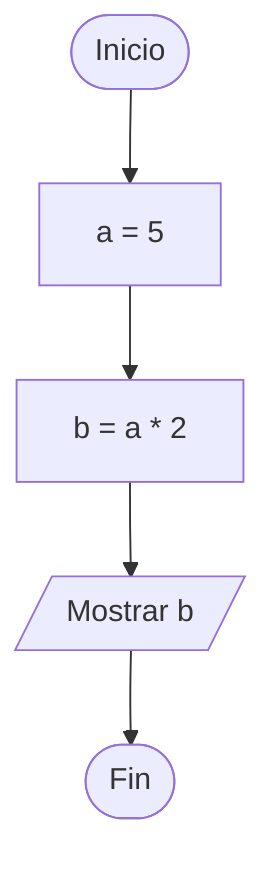
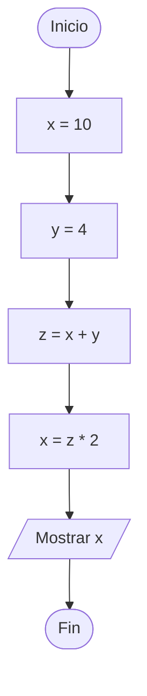
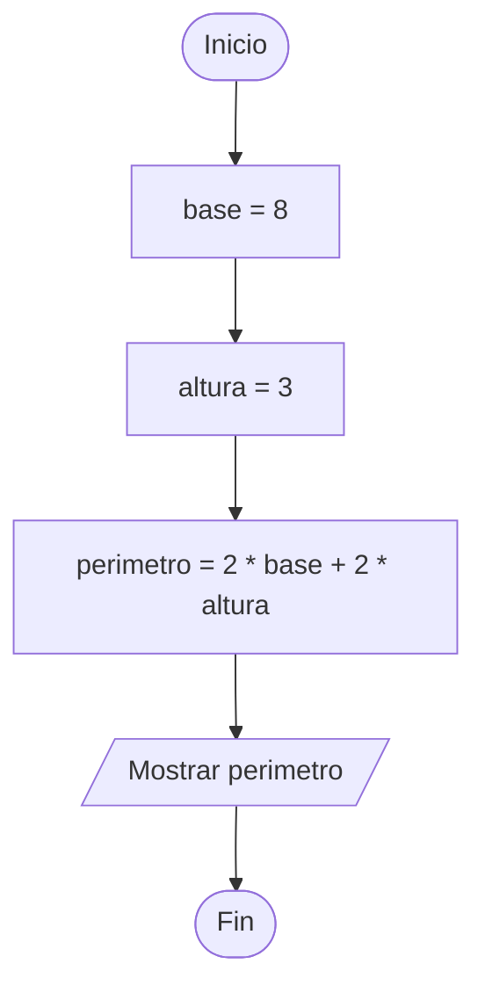
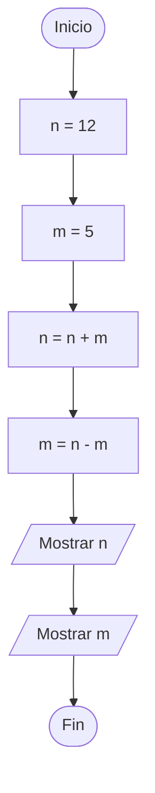
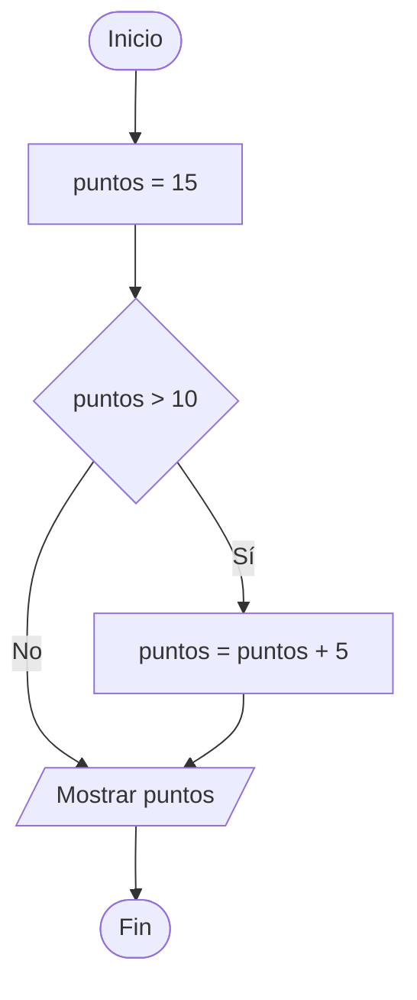
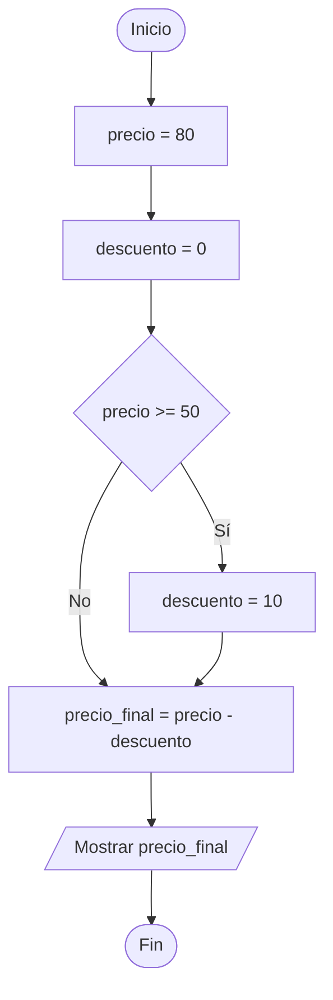
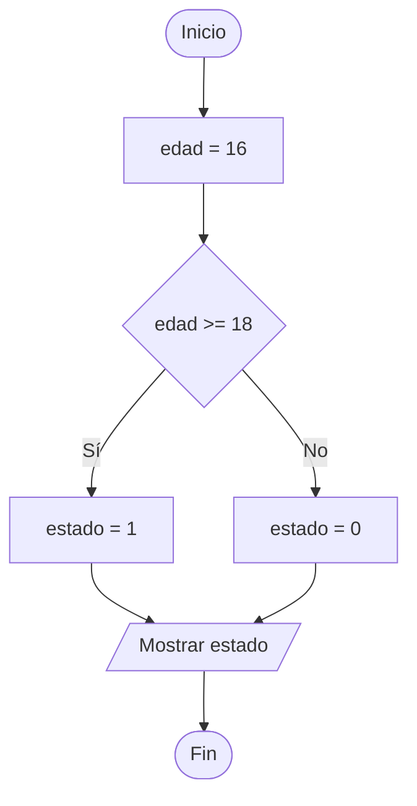
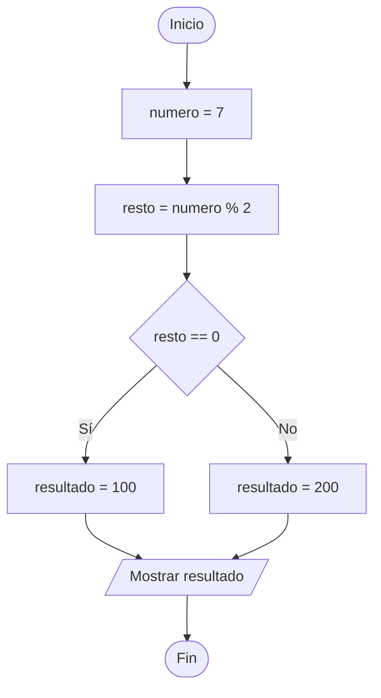
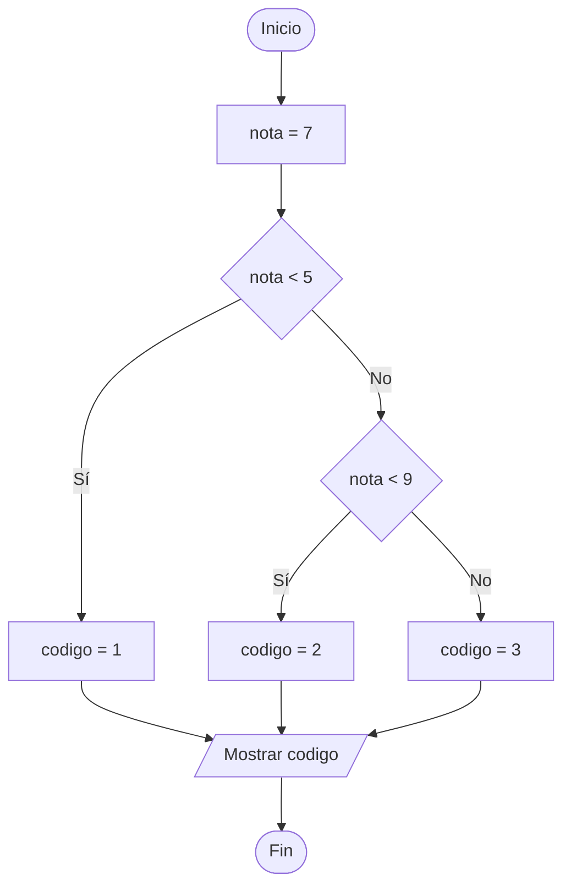
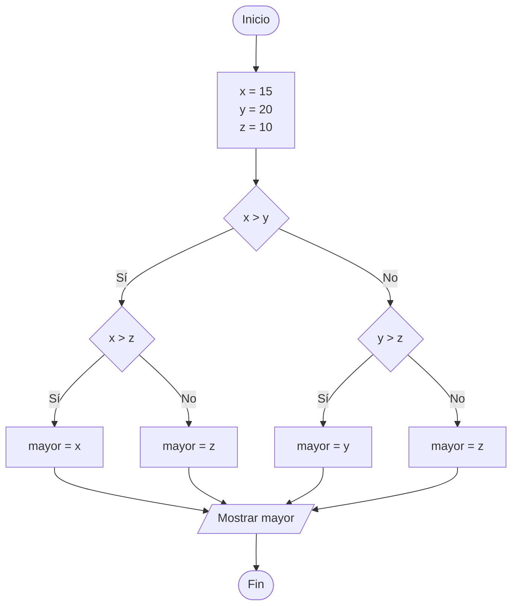

# Ejercicios de leer código solo con números (Soluciones)

### Ejercicio 1: Cálculo del doble de un número

**Descripción:** Asigna un número a una variable, calcula su doble y muestra el resultado.

```python
a = 5
b = a * 2
print(b)
```

**Diagrama de Flujo:**



**Tabla de Traza (Ser la CPU):**

| Paso | Variable `a` | Variable `b` | Salida (Pantalla) |
| :--- | :--- | :--- | :--- |
| 1 | `5` | - | - |
| 2 | `5` | `10` | - |
| 3 | `5` | `10` | `10` |

---

### Ejercicio 2: Suma y multiplicación simple

**Descripción:** Modifica varias variables numéricas realizando operaciones aritméticas básicas.

```python
x = 10
y = 4
z = x + y
x = z * 2
print(x)
```

**Diagrama de Flujo:**



**Tabla de Traza (Ser la CPU):**

| Paso | Variable `x` | Variable `y` | Variable `z` | Salida (Pantalla) |
| :--- | :--- | :--- | :--- | :--- |
| 1 | `10` | - | - | - |
| 2 | `10` | `4` | - | - |
| 3 | `10` | `4` | `14` | - |
| 4 | `28` | `4` | `14` | - |
| 5 | `28` | `4` | `14` | `28` |

---

### Ejercicio 3: Cálculo del perímetro de un rectángulo

**Descripción:** Calcula el perímetro a partir de la base y la altura de un rectángulo.

```python
base = 8
altura = 3
perimetro = 2 * base + 2 * altura
print(perimetro)
```

**Diagrama de Flujo:**



**Tabla de Traza (Ser la CPU):**

| Paso | Variable `base` | Variable `altura` | Variable `perimetro` | Salida (Pantalla) |
| :--- | :--- | :--- | :--- | :--- |
| 1 | `8` | - | - | - |
| 2 | `8` | `3` | - | - |
| 3 | `8` | `3` | `22` | - |
| 4 | `8` | `3` | `22` | `22` |

---

### Ejercicio 4: Intercambio y reasignación de valores

**Descripción:** Muestra cómo el valor de una variable cambia a lo largo de la ejecución.

```python
n = 12
m = 5
n = n + m
m = n - m
print(n)
print(m)
```

**Diagrama de Flujo:**



**Tabla de Traza (Ser la CPU):**

| Paso | Variable `n` | Variable `m` | Salida (Pantalla) |
| :--- | :--- | :--- | :--- |
| 1 | `12` | - | - |
| 2 | `12` | `5` | - |
| 3 | `17` | `5` | - |
| 4 | `17` | `12` | - |
| 5 | `17` | `12` | `17` |
| 6 | `17` | `12` | `12` |

---

## Bloque 2: Programas Condicionales Simples (`if` solo)

### Ejercicio 5: Detector de números positivos

**Descripción:** Comprueba si un número es positivo y, solo en ese caso, le suma un bono.

```python
puntos = 15
if puntos > 10:
    puntos = puntos + 5
print(puntos)
```

**Diagrama de Flujo:**



**Tabla de Traza (Ser la CPU):**

| Paso | Variable `puntos` | ¿`puntos > 10`? | Salida (Pantalla) |
| :--- | :--- | :--- | :--- |
| 1 | `15` | - | - |
| 2 | `15` | **Verdadero** | - |
| 3 | `20` | - | - |
| 4 | `20` | - | `20` |

---

### Ejercicio 6: Descuento aplicable

**Descripción:** Aplica un descuento si el importe supera cierto umbral.

```python
precio = 80
descuento = 0
if precio >= 50:
    descuento = 10
precio_final = precio - descuento
print(precio_final)
```

**Diagrama de Flujo:**



**Tabla de Traza (Ser la CPU):**

| Paso | Variable `precio` | Variable `descuento` | ¿`precio >= 50`? | Variable `precio_final` | Salida (Pantalla) |
| :--- | :--- | :--- | :--- | :--- | :--- |
| 1 | `80` | - | - | - | - |
| 2 | `80` | `0` | - | - | - |
| 3 | `80` | `0` | **Verdadero** | - | - |
| 4 | `80` | `10` | - | - | - |
| 5 | `80` | `10` | - | `70` | - |
| 6 | `80` | `10` | - | `70` | `70` |

---

## Bloque 3: Programas Condicionales Dobles (`if` / `else`)

### Ejercicio 7: Mayoría de edad

**Descripción:** Determina un estado numérico dependiendo de si una edad alcanza o no los 18 años.

```python
edad = 16
if edad >= 18:
    estado = 1
else:
    estado = 0
print(estado)
```

**Diagrama de Flujo:**



**Tabla de Traza (Ser la CPU):**

| Paso | Variable `edad` | ¿`edad >= 18`? | Variable `estado` | Salida (Pantalla) |
| :--- | :--- | :--- | :--- | :--- |
| 1 | `16` | - | - | - |
| 2 | `16` | **Falso** | - | - |
| 3 | `16` | - | `0` | - |
| 4 | `16` | - | `0` | `0` |

---

### Ejercicio 8: Par o Impar (mediante residuo)

**Descripción:** Determina si un número es par o impar usando el operador módulo `%`.

```python
numero = 7
resto = numero % 2
if resto == 0:
    resultado = 100
else:
    resultado = 200
print(resultado)
```

**Diagrama de Flujo:**



**Tabla de Traza (Ser la CPU):**

| Paso | Variable `numero` | Variable `resto` | ¿`resto == 0`? | Variable `resultado` | Salida (Pantalla) |
| :--- | :--- | :--- | :--- | :--- | :--- |
| 1 | `7` | - | - | - | - |
| 2 | `7` | `1` | - | - | - |
| 3 | `7` | `1` | **Falso** | - | - |
| 4 | `7` | `1` | - | `200` | - |
| 5 | `7` | `1` | - | `200` | `200` |

---

## Bloque 4: Programas con Condiciones Anidadas (`if` / `else` anidados)

### Ejercicio 9: Clasificación de notas numéricas

**Descripción:** Clasifica una nota numérica en tres rangos usando códigos numéricos.

```python
nota = 7
if nota < 5:
    codigo = 1
else:
    if nota < 9:
        codigo = 2
    else:
        codigo = 3
print(codigo)
```

**Diagrama de Flujo:**



**Tabla de Traza (Ser la CPU):**

| Paso | Variable `nota` | ¿`nota < 5`? | ¿`nota < 9`? | Variable `codigo` | Salida (Pantalla) |
| :--- | :--- | :--- | :--- | :--- | :--- |
| 1 | `7` | - | - | - | - |
| 2 | `7` | **Falso** | - | - | - |
| 3 | `7` | - | **Verdadero** | - | - |
| 4 | `7` | - | - | `2` | - |
| 5 | `7` | - | - | `2` | `2` |

---

### Ejercicio 10: Comparación de tres números

**Descripción:** Encuentra el mayor entre tres valores dados utilizando estructuras condicionales anidadas.

```python
x = 15
y = 20
z = 10

if x > y:
    if x > z:
        mayor = x
    else:
        mayor = z
else:
    if y > z:
        mayor = y
    else:
        mayor = z

print(mayor)
```

**Diagrama de Flujo:**



**Tabla de Traza (Ser la CPU):**

| Paso | Variable `x` | Variable `y` | Variable `z` | ¿`x > y`? | ¿`y > z`? | Variable `mayor` | Salida (Pantalla) |
| :--- | :--- | :--- | :--- | :--- | :--- | :--- | :--- |
| 1 | `15` | `20` | `10` | - | - | - | - |
| 2 | `15` | `20` | `10` | **Falso** | - | - | - |
| 3 | `15` | `20` | `10` | - | **Verdadero** | - | - |
| 4 | `15` | `20` | `10` | - | - | `20` | - |
| 5 | `15` | `20` | `10` | - | - | `20` | `20` |

---
