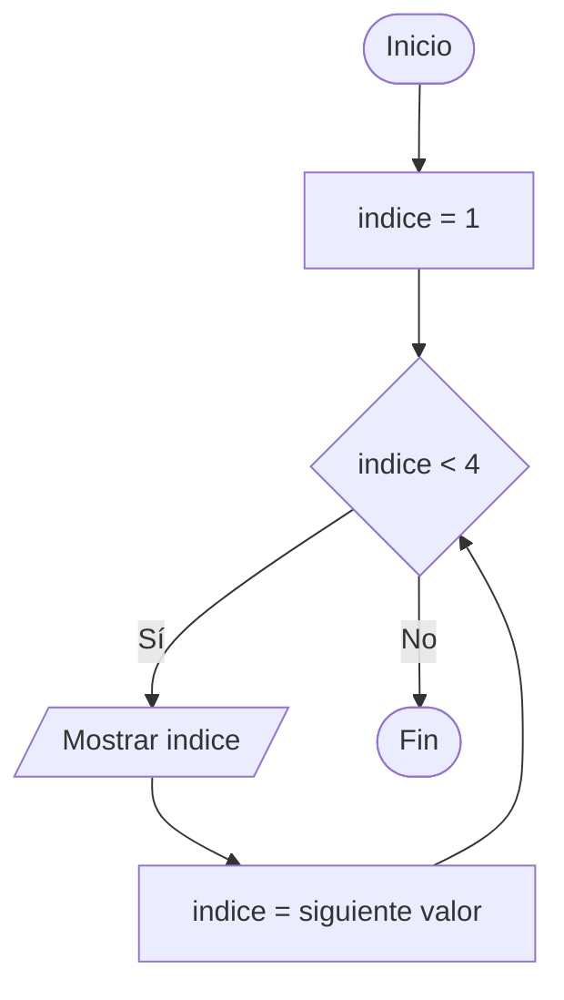
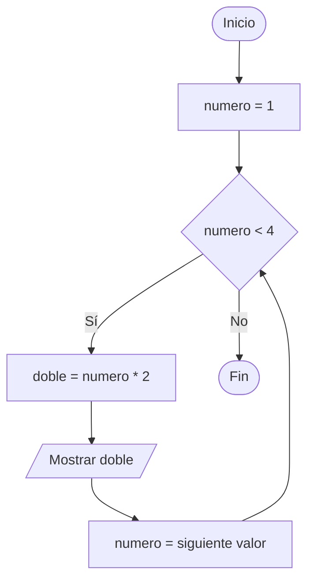
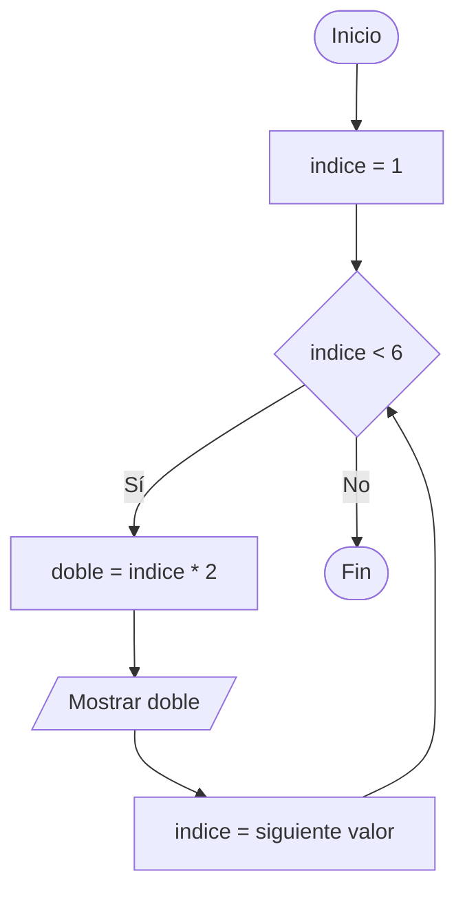
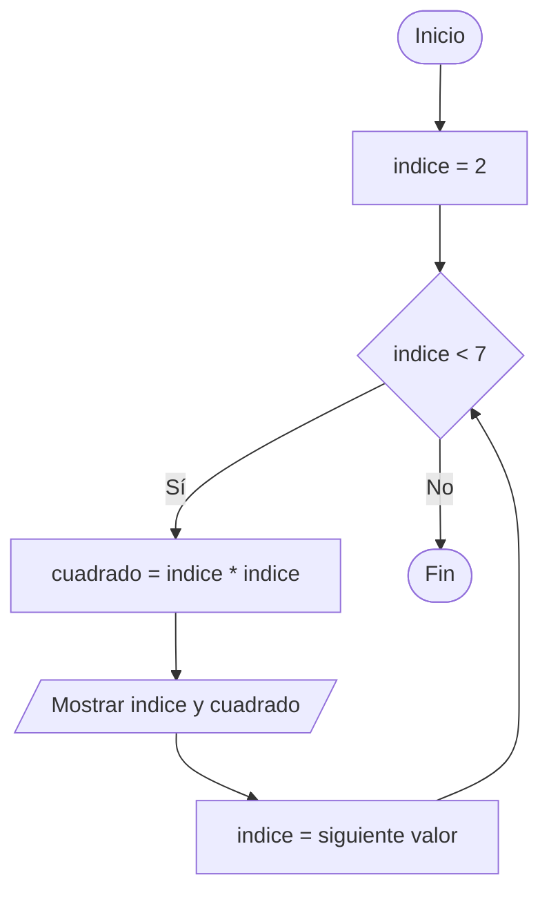
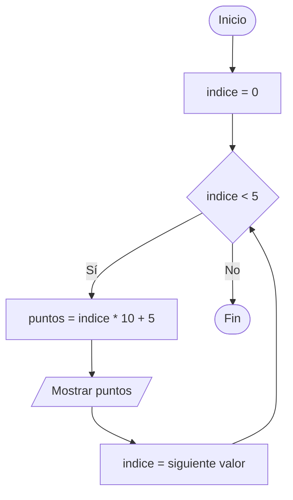
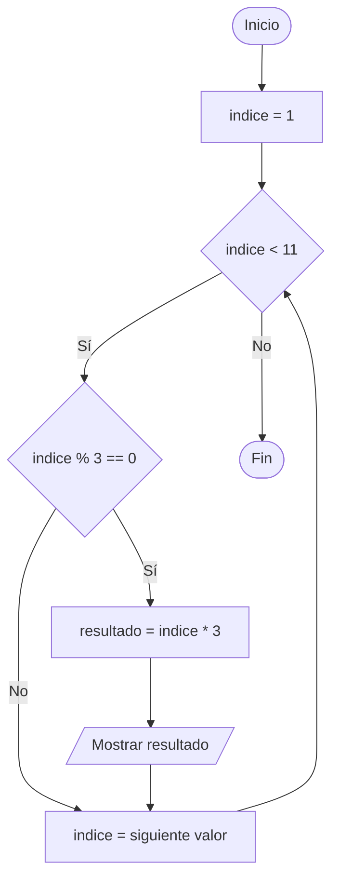
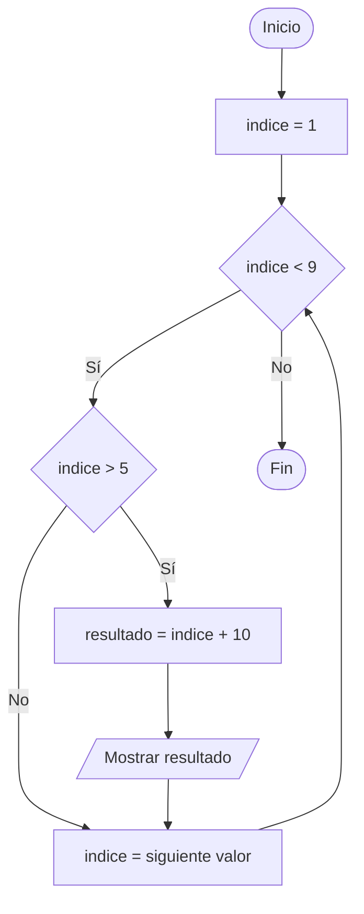
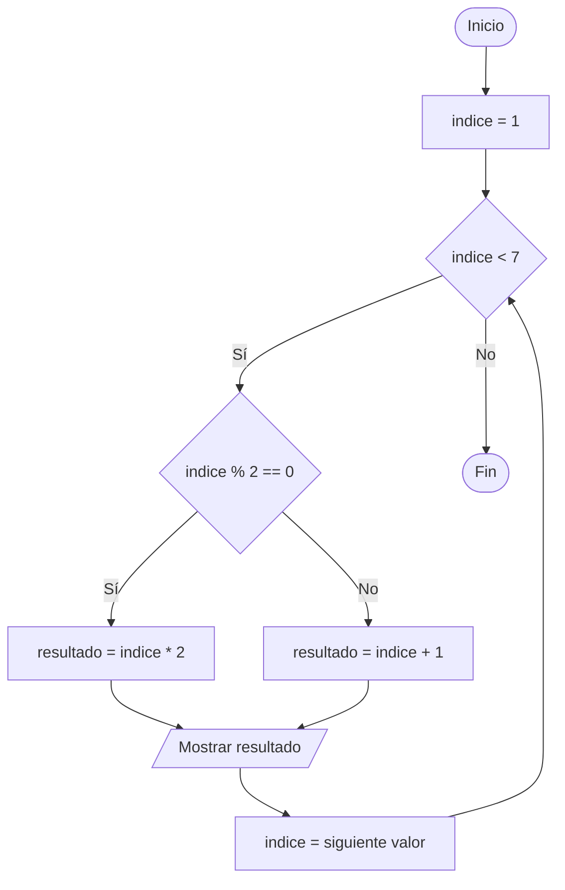
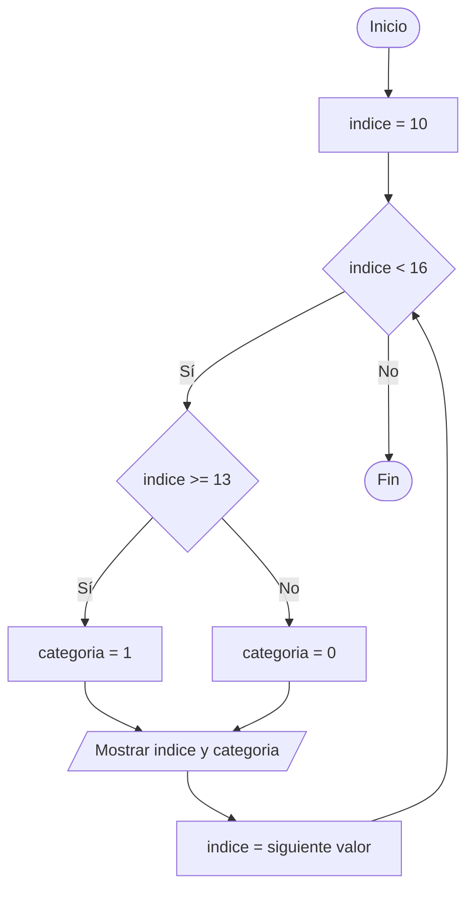

# Ejercicios de leer código con bucles y condiciones

**Tema:** Bucles `for` y condiciones

---

## Antes de empezar

En estos ejercicios se utiliza `range(inicio, final)` para repetir instrucciones desde `inicio` hasta `final - 1`. La variable del bucle, llamada `indice`, toma un valor diferente en cada repetición.

Lee cada programa paso a paso, completa una tabla de variables y escribe qué muestra por pantalla.

---

## Bloque 1: Bucles `for` con cálculos

## ¿Cómo funciona un bucle `for`?

Un bucle `for` repite un grupo de instrucciones varias veces. En cada repetición, una variable recibe el siguiente valor de una secuencia.

La estructura básica es:

```python
for variable in range(inicio, final):
    instrucciones
```

La función `range(inicio, final)` empieza en `inicio` y termina antes de llegar a `final`. Primero podemos observar únicamente los valores que toma la variable:

```python
for numero in range(1, 4):
    print(numero)
```

El bucle se repite tres veces y muestra:

| Repetición | Valor de `numero` | Salida |
| :--- | :---: | :---: |
| 1 | 1 | 1 |
| 2 | 2 | 2 |
| 3 | 3 | 3 |

```text
1
2
3
```

**Diagrama de Flujo:**



Después podemos utilizar ese índice para realizar un cálculo:

```python
for numero in range(1, 4):
    doble = numero * 2
    print(doble)
```

En este caso, el programa muestra:

```text
2
4
6
```

**Diagrama de Flujo:**



### Ejercicio 1: Dobles de los números

```python
for indice in range(1, 6):
    doble = indice * 2
    print(doble)
```

**Diagrama de Flujo:**



**Tarea:** Escribe todos los valores que muestra el programa.

---

### Ejercicio 2: Cuadrados de los números

```python
for indice in range(2, 7):
    cuadrado = indice * indice
    print(indice, cuadrado)
```

**Diagrama de Flujo:**



**Tarea:** Completa una tabla con las columnas `indice` y `cuadrado`.

---

### Ejercicio 3: Cálculo de puntos

```python
for indice in range(0, 5):
    puntos = indice * 10 + 5
    print(puntos)
```

**Diagrama de Flujo:**



**Tarea:** Indica qué valor de `puntos` se obtiene en cada repetición.

---

## Bloque 2: Bucle `for` con `if`

### Ejercicio 4: Múltiplos de tres

```python
for indice in range(1, 11):
    if indice % 3 == 0:
        resultado = indice * 3
        print(resultado)
```

**Diagrama de Flujo:**



**Tarea:** Explica qué números pasan la condición y qué valores se muestran.

---

### Ejercicio 5: Mayores que cinco

```python
for indice in range(1, 9):
    if indice > 5:
        resultado = indice + 10
        print(resultado)
```

**Diagrama de Flujo:**



**Tarea:** Escribe los valores de `indice` que cumplen la condición y el resultado correspondiente.

---

## Bloque 3: Bucle `for` con `if` / `else`

### Ejercicio 6: Par o impar

```python
for indice in range(1, 7):
    if indice % 2 == 0:
        resultado = indice * 2
    else:
        resultado = indice + 1
    print(resultado)
```

**Diagrama de Flujo:**



**Tarea:** Completa una tabla con `indice`, la rama que se ejecuta y `resultado`.

---

### Ejercicio 7: Clasificación de temperaturas

```python
for indice in range(10, 16):
    if indice >= 13:
        categoria = 1
    else:
        categoria = 0
    print(indice, categoria)
```

**Diagrama de Flujo:**



**Tarea:** Indica qué temperaturas reciben la categoría `0` y cuáles reciben la categoría `1`.

---
