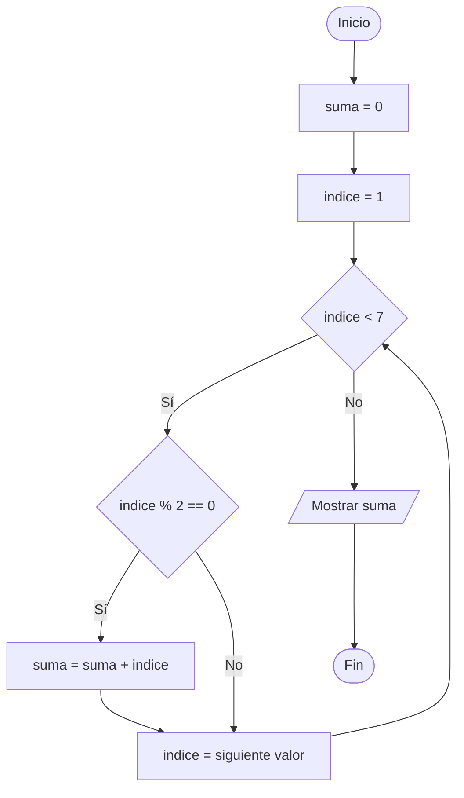

# Retos de leer código con bucles y condiciones

## Retos para el alumnado

### Reto 0: Del diagrama de flujo al código

Observa el siguiente diagrama de flujo y escribe el programa Python equivalente. El programa debe mostrar la suma de los números pares del `1` al `6`.

**Restricción:** Utiliza un bucle `for`, una condición `if` y una variable acumuladora llamada `suma`.

---

### Reto 1: Tabla de multiplicar

Crea un programa que utilice un bucle `for` para mostrar la tabla de multiplicar del número `7`, desde `7 x 1` hasta `7 x 10`.

**Restricción:** Utiliza el índice del bucle para calcular cada producto.
**Además:** Dibuja el diagrama de flujo correspondiente al programa.

---

### Reto 2: Suma de números

Crea un programa que recorra los números del `1` al `10` y muestre el doble de cada número.

**Restricción:** Utiliza un bucle `for` y una variable llamada `doble`.
**Además:** Dibuja el diagrama de flujo correspondiente al programa.

---

### Reto 3: Números divisibles

Crea un programa que recorra los números del `1` al `20` y muestre solamente los que sean divisibles entre `4`.

**Restricción:** Utiliza un bucle `for`, una condición `if` y el operador `%`.
**Además:** Dibuja el diagrama de flujo correspondiente al programa.

---

### Reto 4: Clasificador de edades

Crea un programa que recorra las edades del `12` al `18`. Para cada edad, muestra el texto o código que indique si es menor de edad o si ha alcanzado la mayoría de edad.

**Restricción:** Utiliza un bucle `for` y una estructura `if` / `else`.
**Además:** Dibuja el diagrama de flujo correspondiente al programa.

---

### Reto 5: Puntuación por rondas

Un juego tiene `8` rondas numeradas del `1` al `8`. Crea un programa que recorra todas las rondas y calcule los puntos de cada una:

- En las rondas impares (`1`, `3`, `5` y `7`) se obtienen `10` puntos.
- En las rondas pares (`2`, `4`, `6` y `8`) se obtienen `20` puntos.

El programa debe mostrar el número de cada ronda y los puntos conseguidos en ella. Por ejemplo, la ronda `1` tendría `10` puntos y la ronda `2` tendría `20` puntos.

**Restricción:** Utiliza un bucle `for`, una estructura `if` / `else` y el operador `%`.
**Además:** Dibuja el diagrama de flujo correspondiente al programa.
