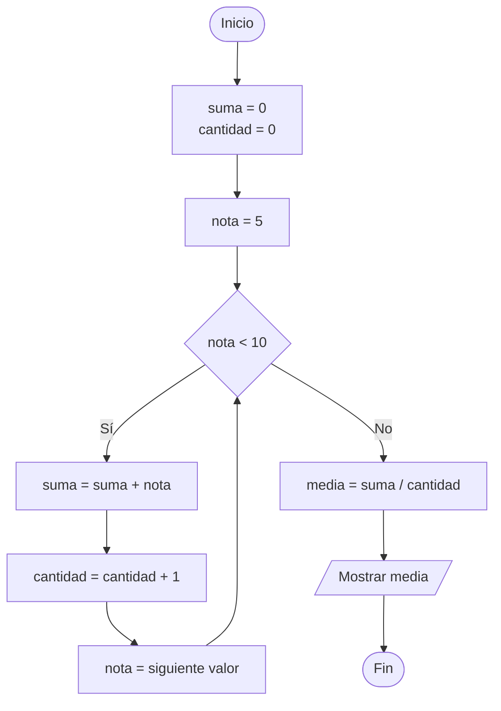
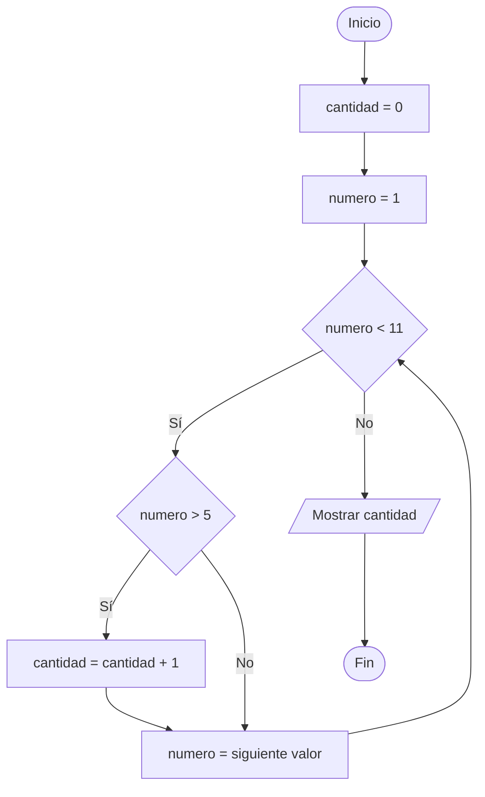
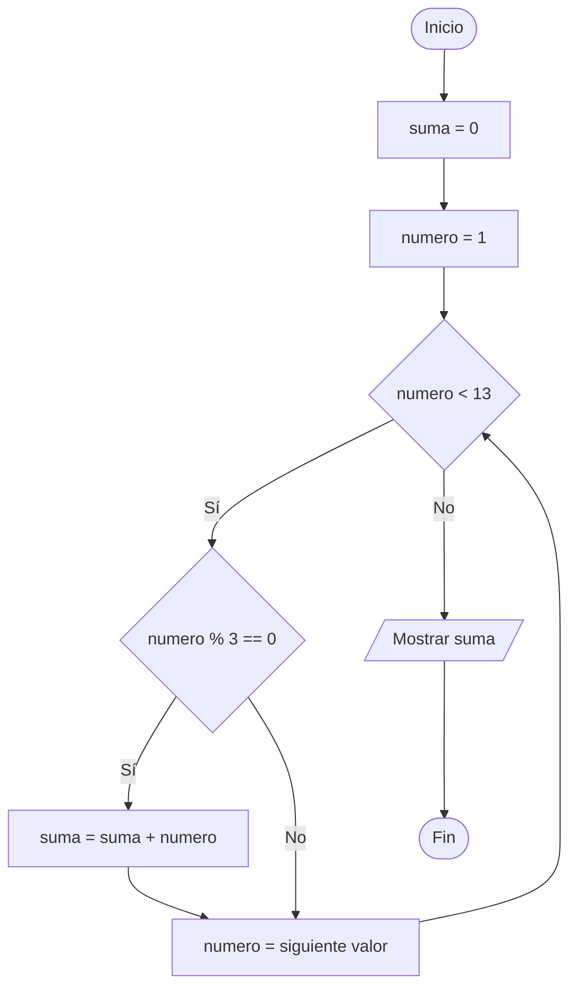
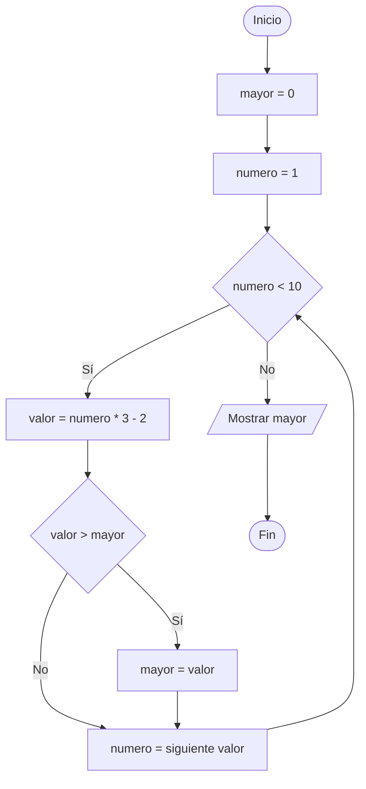

# Ejercicios de leer código con acumuladores

**Tema:** Bucles, condiciones y variables acumuladoras

---

## ¿Qué es una variable acumuladora?

Una variable acumuladora guarda un resultado que se va actualizando en cada repetición del bucle. Normalmente empieza con un valor inicial, como `0`, y después se modifica usando su valor anterior.

Por ejemplo, en `total = total + numero`, la variable `total` conserva lo acumulado hasta ese momento y añade el nuevo `numero`.

---

## Ejercicio 1: Suma de números positivos

```python
suma = 0

for numero in range(1, 8):
    if numero % 2 == 0:
        suma = suma + numero

print(suma)
```

La variable `suma` acumula únicamente los números pares. El programa muestra `12`.

**Diagrama de Flujo:**


---

## Ejercicio 2: Media de varias notas

```python
suma = 0
cantidad = 0

for nota in range(5, 10):
    suma = suma + nota
    cantidad = cantidad + 1

media = suma / cantidad
print(media)
```

Las variables `suma` y `cantidad` se actualizan en cada vuelta. Al final, `media` contiene la media de las notas `5`, `6`, `7`, `8` y `9`. El programa muestra `7.0`.

**Diagrama de Flujo:**



---

## Ejercicio 3: Cuenta de números mayores que cinco

```python
cantidad = 0

for numero in range(1, 11):
    if numero > 5:
        cantidad = cantidad + 1

print(cantidad)
```

La variable `cantidad` cuenta cuántos números son mayores que `5`. El programa muestra `5`.

**Diagrama de Flujo:**



---

## Ejercicio 4: Suma de múltiplos de tres

```python
suma = 0

for numero in range(1, 13):
    if numero % 3 == 0:
        suma = suma + numero

print(suma)
```

La variable `suma` acumula los múltiplos de `3`: `3`, `6`, `9` y `12`. El programa muestra `30`.

**Diagrama de Flujo:**



---

## Ejercicio 5: Mayor valor encontrado

```python
mayor = 0

for numero in range(1, 10):
    valor = numero * 3 - 2
    if valor > mayor:
        mayor = valor

print(mayor)
```

La variable `mayor` conserva el valor más grande encontrado hasta cada momento. El programa muestra `25`.

**Diagrama de Flujo:**



---
