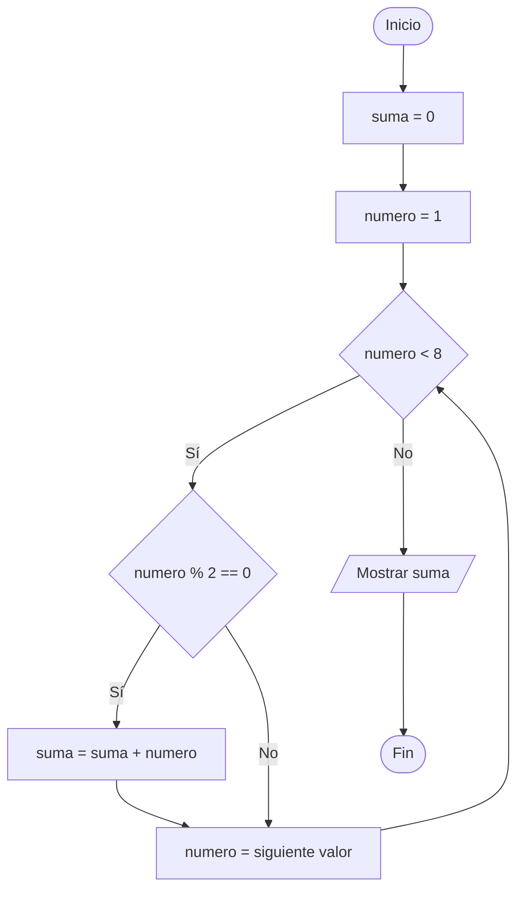
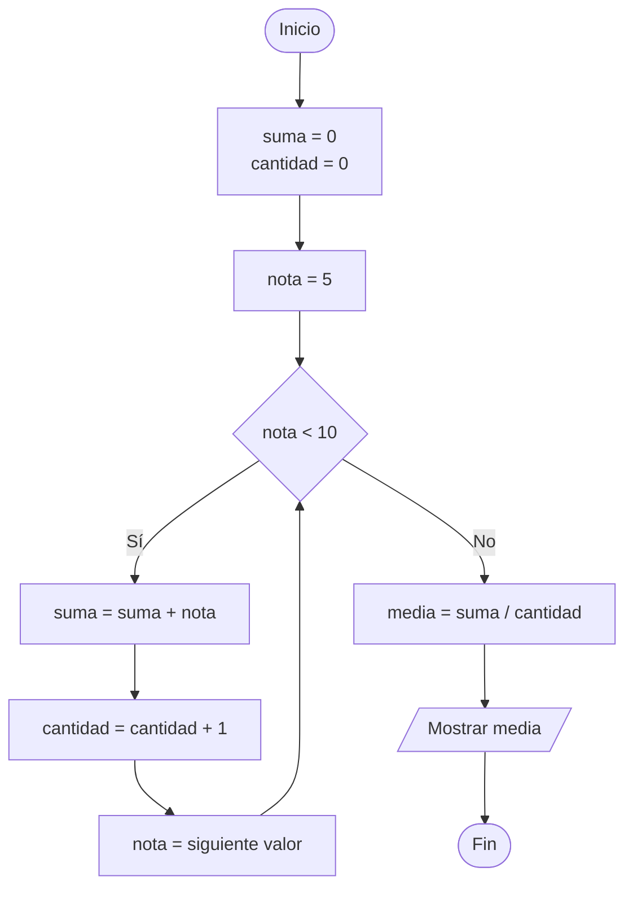
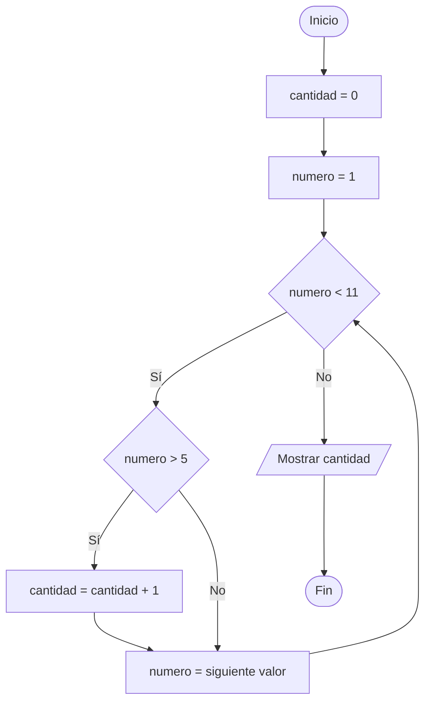
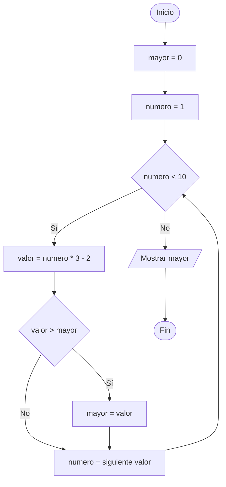

# Ejercicios de Programación en Python para 3º ESO

**Tema:** Bucles, condiciones y variables acumuladoras - solución

---

## ¿Qué es una variable acumuladora?

Una variable acumuladora guarda un resultado que se va actualizando en cada repetición del bucle. Suele comenzar con un valor inicial, como `0`, y se modifica usando su valor anterior.

En las tablas, el símbolo `-` indica que una variable todavía no se ha calculado o que no se ha producido ninguna salida en esa repetición.

---

## Ejercicio 1: Suma de números positivos

```python
suma = 0

for numero in range(1, 8):
    if numero % 2 == 0:
        suma = suma + numero

print(suma)
```

La variable `suma` acumula únicamente los números pares. El programa muestra `12`.

| Repetición | `numero` | ¿`numero % 2 == 0`? | `suma` después de la condición | Salida |
| :--- | :---: | :---: | :---: | :---: |
| 1 | 1 | Falso | 0 | - |
| 2 | 2 | Verdadero | 2 | - |
| 3 | 3 | Falso | 2 | - |
| 4 | 4 | Verdadero | 6 | - |
| 5 | 5 | Falso | 6 | - |
| 6 | 6 | Verdadero | 12 | - |
| 7 | 7 | Falso | 12 | - |
| Final | - | - | 12 | 12 |

**Diagrama de Flujo:**



---

## Ejercicio 2: Media de varias notas

```python
suma = 0
cantidad = 0

for nota in range(5, 10):
    suma = suma + nota
    cantidad = cantidad + 1

media = suma / cantidad
print(media)
```

Las variables `suma` y `cantidad` se actualizan en cada vuelta. Al final, `media` contiene la media de `5`, `6`, `7`, `8` y `9`.

| Repetición | `nota` | `suma` | `cantidad` | `media` | Salida |
| :--- | :---: | :---: | :---: | :---: | :---: |
| 1 | 5 | 5 | 1 | - | - |
| 2 | 6 | 11 | 2 | - | - |
| 3 | 7 | 18 | 3 | - | - |
| 4 | 8 | 26 | 4 | - | - |
| 5 | 9 | 35 | 5 | - | - |
| Final | - | 35 | 5 | 7.0 | 7.0 |

**Diagrama de Flujo:**



---

## Ejercicio 3: Cuenta de números mayores que cinco

```python
cantidad = 0

for numero in range(1, 11):
    if numero > 5:
        cantidad = cantidad + 1

print(cantidad)
```

La variable `cantidad` cuenta los números mayores que `5`. El programa muestra `5`.

| Repetición | `numero` | ¿`numero > 5`? | `cantidad` después de la condición | Salida |
| :--- | :---: | :---: | :---: | :---: |
| 1 | 1 | Falso | 0 | - |
| 2 | 2 | Falso | 0 | - |
| 3 | 3 | Falso | 0 | - |
| 4 | 4 | Falso | 0 | - |
| 5 | 5 | Falso | 0 | - |
| 6 | 6 | Verdadero | 1 | - |
| 7 | 7 | Verdadero | 2 | - |
| 8 | 8 | Verdadero | 3 | - |
| 9 | 9 | Verdadero | 4 | - |
| 10 | 10 | Verdadero | 5 | - |
| Final | - | - | 5 | 5 |

**Diagrama de Flujo:**



---

## Ejercicio 4: Suma de múltiplos de tres

```python
suma = 0

for numero in range(1, 13):
    if numero % 3 == 0:
        suma = suma + numero

print(suma)
```

La variable `suma` acumula `3`, `6`, `9` y `12`. El programa muestra `30`.

| Repetición | `numero` | ¿`numero % 3 == 0`? | `suma` después de la condición | Salida |
| :--- | :---: | :---: | :---: | :---: |
| 1 | 1 | Falso | 0 | - |
| 2 | 2 | Falso | 0 | - |
| 3 | 3 | Verdadero | 3 | - |
| 4 | 4 | Falso | 3 | - |
| 5 | 5 | Falso | 3 | - |
| 6 | 6 | Verdadero | 9 | - |
| 7 | 7 | Falso | 9 | - |
| 8 | 8 | Falso | 9 | - |
| 9 | 9 | Verdadero | 18 | - |
| 10 | 10 | Falso | 18 | - |
| 11 | 11 | Falso | 18 | - |
| 12 | 12 | Verdadero | 30 | - |
| Final | - | - | 30 | 30 |

**Diagrama de Flujo:**


---

## Ejercicio 5: Mayor valor encontrado

```python
mayor = 0

for numero in range(1, 10):
    valor = numero * 3 - 2
    if valor > mayor:
        mayor = valor

print(mayor)
```

La variable `mayor` conserva el valor más grande encontrado hasta cada momento. El programa muestra `25`.

| Repetición | `numero` | `valor` | ¿`valor > mayor`? | `mayor` después de la condición | Salida |
| :--- | :---: | :---: | :---: | :---: | :---: |
| 1 | 1 | 1 | Verdadero | 1 | - |
| 2 | 2 | 4 | Verdadero | 4 | - |
| 3 | 3 | 7 | Verdadero | 7 | - |
| 4 | 4 | 10 | Verdadero | 10 | - |
| 5 | 5 | 13 | Verdadero | 13 | - |
| 6 | 6 | 16 | Verdadero | 16 | - |
| 7 | 7 | 19 | Verdadero | 19 | - |
| 8 | 8 | 22 | Verdadero | 22 | - |
| 9 | 9 | 25 | Verdadero | 25 | - |
| Final | - | - | - | 25 | 25 |

**Diagrama de Flujo:**



---

## Resumen de resultados

| Ejercicio | Variable acumuladora | Resultado final |
| :--- | :--- | :---: |
| 1 | `suma` | 12 |
| 2 | `suma` y `cantidad` | `media = 7.0` |
| 3 | `cantidad` | 5 |
| 4 | `suma` | 30 |
| 5 | `mayor` | 25 |
