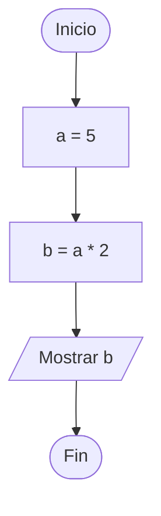
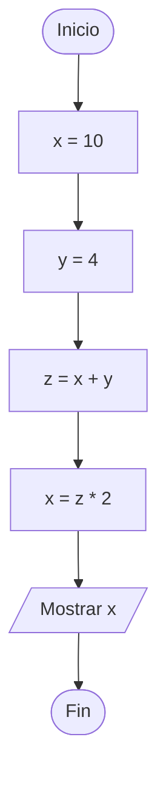
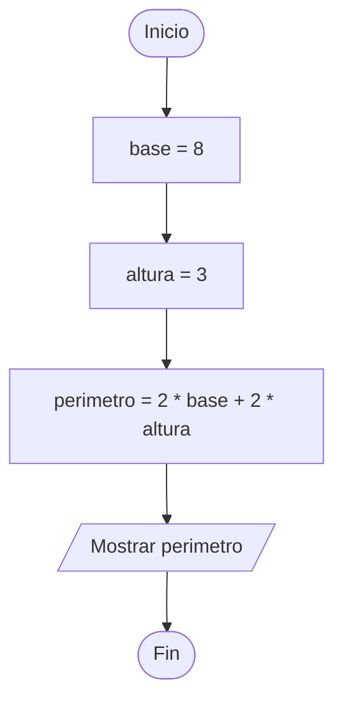
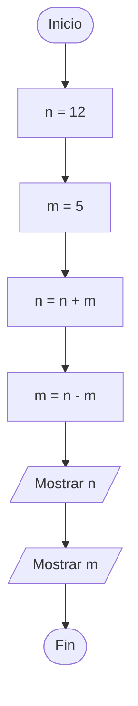
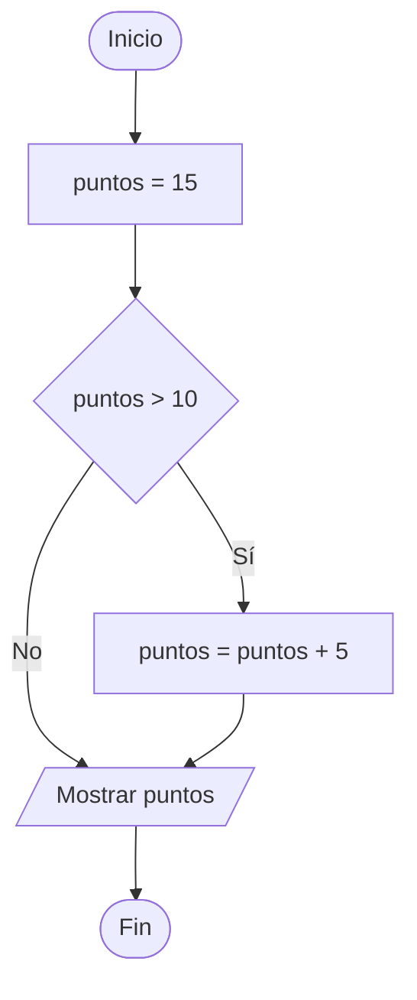
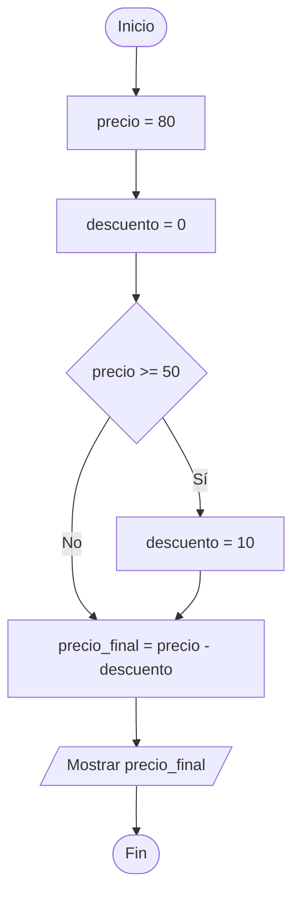
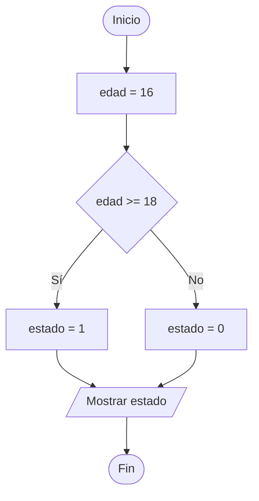
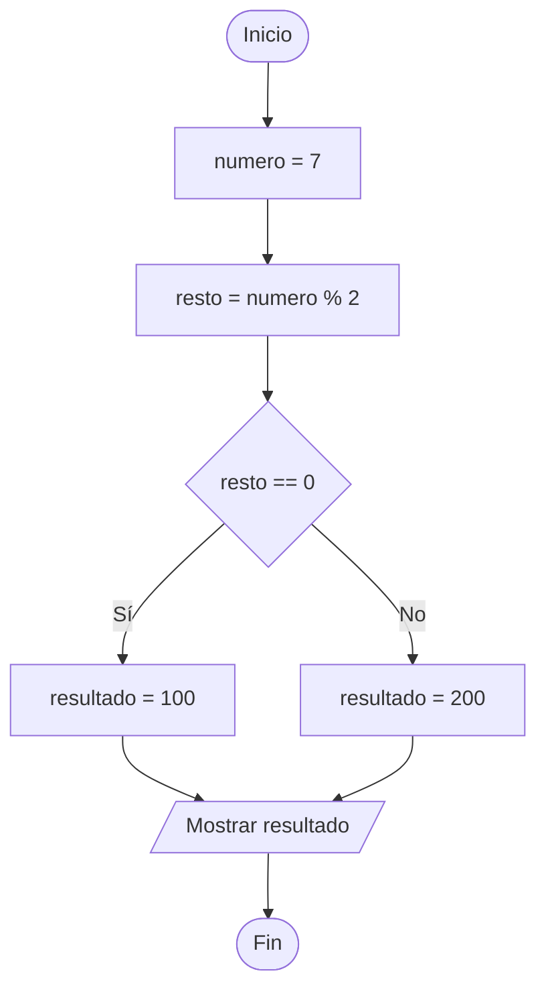
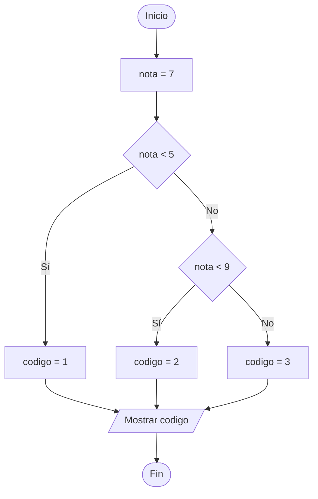
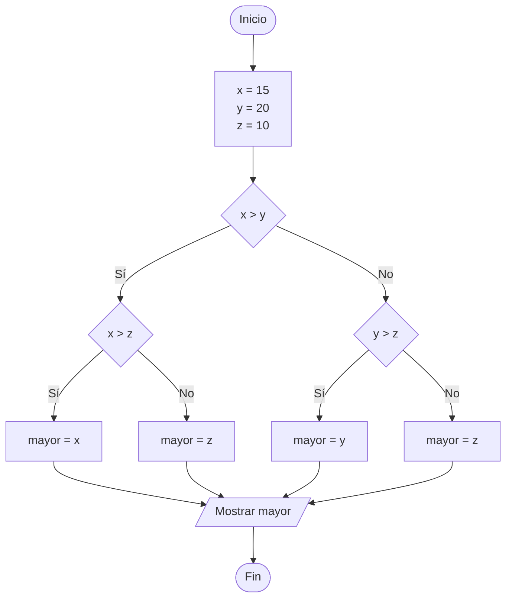

# Ejercicios de Programación en Python para 3º ESO

**Tema:** 1 Introducción a la Programación

---

Ejecuta en un papel los siguientes ejercicios. Crea en un papel la *tabla de variables* resultante
y descubre es lo que lee el usuario mediante la función *print()*.

---

### Ejercicio 1

```python
a = 5
b = a * 2
print(b)
```

**Diagrama de Flujo:**


---

### Ejercicio 2

```python
x = 10
y = 4
z = x + y
x = z * 2
print(x)
```

**Diagrama de Flujo:**



---

### Ejercicio 3

```python
base = 8
altura = 3
perimetro = 2 * base + 2 * altura
print(perimetro)
```

**Diagrama de Flujo:**



---

### Ejercicio 4

```python
n = 12
m = 5
n = n + m
m = n - m
print(n)
print(m)
```

**Diagrama de Flujo:**



---

### Ejercicio 5

```python
puntos = 15
if puntos > 10:
    puntos = puntos + 5
print(puntos)
```

**Diagrama de Flujo:**



---

### Ejercicio 6

```python
precio = 80
descuento = 0
if precio >= 50:
    descuento = 10
precio_final = precio - descuento
print(precio_final)
```

**Diagrama de Flujo:**



---

### Ejercicio 7

```python
edad = 16
if edad >= 18:
    estado = 1
else:
    estado = 0
print(estado)
```

**Diagrama de Flujo:**



---

### Ejercicio 8

```python
numero = 7
resto = numero % 2
if resto == 0:
    resultado = 100
else:
    resultado = 200
print(resultado)
```

**Diagrama de Flujo:**



---

### Ejercicio 9

```python
nota = 7
if nota < 5:
    codigo = 1
else:
    if nota < 9:
        codigo = 2
    else:
        codigo = 3
print(codigo)
```

**Diagrama de Flujo:**



---

### Ejercicio 10


```python
x = 15
y = 20
z = 10

if x > y:
    if x > z:
        mayor = x
    else:
        mayor = z
else:
    if y > z:
        mayor = y
    else:
        mayor = z

print(mayor)
```

**Diagrama de Flujo:**



---

### Reto 1: Conversor de Temperatura

* Crea un programa que declare una variable `celsius` con el valor `25`. Calcula la temperatura equivalente en grados Fahrenheit utilizando la fórmula

```
F = C x 1.8 + 32
```

donde `C` representa la variable `celsius` y `F` la variable `farenheit`, que es donde guardas el resultado final.

Finalmente, muestra el valor de `fahrenheit`.

---

### Reto 2: Control de Aforo

* **Enunciado:** Una sala de juegos tiene un límite de capacidad de 30 personas. Crea un programa que tenga una variable `personas` con el valor `34`.
  * Si la variable `personas` es mayor que 30, define una variable `exceso` que contenga cuántas personas están por encima del límite y muestra `exceso`.
  * En caso contrario (si es menor o igual a 30), asigna el valor `0` a `exceso` y muéstralo.
* **Restricción:** Usa una estructura `if` / `else`.

---

### Reto 3: Calificador de Rangos Numéricos

* **Enunciado:** Crea un programa con una variable `num` inicializada en `45`.
  * Si `num` es menor que `0`, guarda en la variable `categoria` el valor `-1`.
  * Si `num` está entre `0` y `50` (incluidos), guarda en `categoria` el valor `0`.
  * Si `num` es mayor que `50`, guarda en `categoria` el valor `1`.
  * Al final, muestra la variable `categoria`.
* **Restricción:** Utiliza estructuras `if` / `else` anidadas y solo expresiones numéricas/comparaciones básicas.


